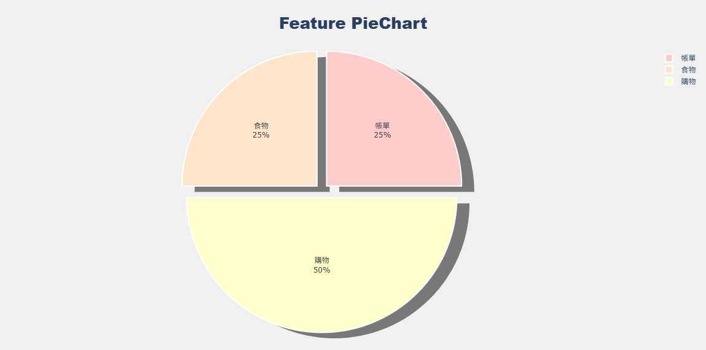

##  軟體工程導論 Assignment 2 - 記帳小工具 
這是軟體工程導論課程的作業 2

做出一個簡單的 Python 費用追蹤工具，可以輸入支出資料並產生圓餅圖

## 專案成員
* Member A (Input Module): [黃郁芬/1122915]
* Member B (Visualization Module): [王子萓/1122917]

## 環境設定 
請確保已安裝 Python 3.x

本專案的視覺化模組需要使用 plotly 函式庫，請執行以下指令安裝套件：

```bash
pip install plotly
```
## 檔案說明
* input_module.py: 負責處理使用者輸入，將日期、金額、類別存入 CSV 檔

* visualiztion_module.py: 讀取 CSV 資料並繪製出圓餅圖

* expenses.csv: 程式自動產生的資料儲存檔 (執行輸入模組後會自動建立)
## 如何執行
1. 輸入費用資料 (Input Module)

   執行輸入模組來新增消費紀錄：
```Bash
python input_module.py
```
  操作說明： 
  
  * 依照螢幕提示輸入日期、金額、類別與備註
  
  * 輸入完成後可選擇繼續新增或離開

2. 產生圓餅圖 (Visualization Module)
執行視覺化模組來查看統計圖表：

```Bash
python visualiztion_module.py
```
操作說明：

* 程式執行後會自動在瀏覽器中開啟一個分頁，顯示圓餅圖

* 將滑鼠移到區塊上可查看詳細金額與占比

## 執行結果範例圖

